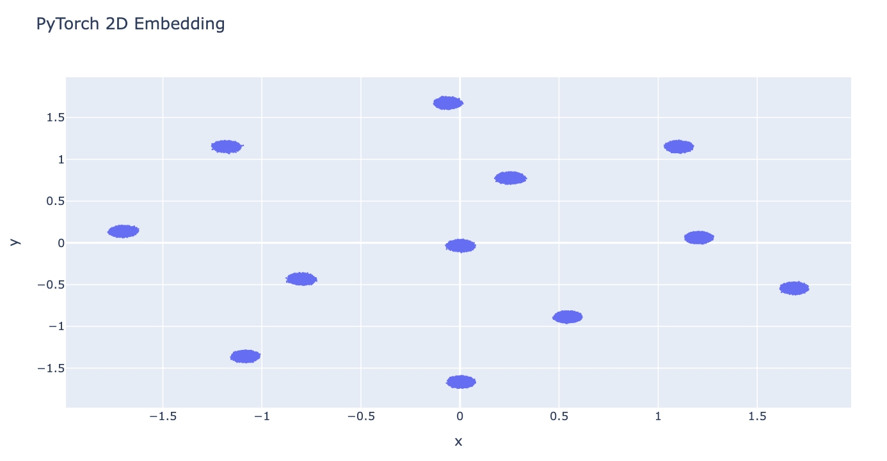

<!-- Logo + Project title -->
<p align="center">
  
</p>
<p align="center">
  <a href="https://opensource.org/licenses/Apache-2.0">
    
  </a>
  <a href="https://www.python.org/downloads/">
    
  </a>
  <a href="https://pypi.org/project/dire-rapids/">
    
  </a>
  <a href="https://pepy.tech/projects/dire-rapids">
    
  </a>
</p>
<p align="center">
  <a href="https://github.com/sashakolpakov/dire-rapids/actions/workflows/pylint.yml">
    
  </a>
  <a href="https://github.com/sashakolpakov/dire-rapids/actions/workflows/deploy_docs.yml">
    
  </a>
  <a href="https://sashakolpakov.github.io/dire-rapids/">
    
  </a>
</p>

# DiRe Rapids

GPU-accelerated implementation of [DiRe](https://github.com/sashakolpakov/dire-jax) using PyTorch and optionally NVIDIA RAPIDS for massive-scale datasets.

## Installation

### From Repository (development)

```bash
# Clone the repository
git clone https://github.com/sashakolpakov/dire-rapids.git
cd dire-rapids

# Basic installation (CPU + PyTorch)
pip install -e .

# With CUDA support
pip install -e .[cuda]

# For development (includes testing and dev tools)
pip install -e .[dev]
```

#### With RAPIDS Support (Optional, GPU only)

First, install RAPIDS following provided [installation instructions](https://docs.rapids.ai/install/). 
```bash
# Then install dire-rapids with RAPIDS support
pip install -e .[rapids]
```

### From PyPI (stable)

```bash
# Use the above installation options
pip install dire-rapids[options]
```

## Quick Start [](https://colab.research.google.com/github/sashakolpakov/dire-rapids/blob/main/benchmarking/dire_rapids_benchmarks.ipynb)

You can import the standard or memory-efficient backend for DiRe. Also, some datasets is needed: we shall use higher-dimensional Blobs as a simple visual test. 

```python
from dire_rapids import DiRePyTorch, DiRePyTorchMemoryEfficient
from sklearn.datasets import make_blobs
```
The standard backend will work for the example below, but not necessarily for a larger (100x) dataset. 

```python
# Generate sample data
X, _ = make_blobs(n_samples=1_000, centers=12, n_features=10, random_state=42)

# Standard PyTorch implementation
reducer = DiRePyTorch(n_components=2, n_neighbors=16, verbose=True)
X_embedded = reducer.fit_transform(X)
```
The memory-efficient version gets you there (how soon, depends on the hardware). 

```python
reducer = DiRePyTorchMemoryEfficient(n_components=2, n_neighbors=16, verbose=True)
X_embedded = reducer.fit_transform(X)
```

### Custom Distance Metrics

DiRe Rapids now supports custom distance metrics for k-nearest neighbor computation, while keeping the layout forces Euclidean for optimal embedding quality:

```python
# Using L1 (Manhattan) distance for k-NN
reducer = DiRePyTorch(
    metric='(x - y).abs().sum(-1)',
    n_neighbors=32,
    verbose=True
)
X_embedded = reducer.fit_transform(X)

# Using cosine distance for k-NN
def cosine_distance(x, y):
    return 1 - (x * y).sum(-1) / (x.norm(dim=-1, keepdim=True) * y.norm(dim=-1, keepdim=True) + 1e-8)

reducer = DiRePyTorch(
    metric=cosine_distance,
    n_neighbors=32
)
X_embedded = reducer.fit_transform(X)

# Custom metrics work with all backends
reducer = DiRePyTorchMemoryEfficient(
    metric='(x - y).abs().sum(-1)',  # L1 distance
    use_fp16=True,
    n_neighbors=32
)
X_embedded = reducer.fit_transform(X)
```

**Supported Metric Types:**
- **None** or `'euclidean'`/`'l2'`: Fast built-in Euclidean distance (default)
- **String expressions**: Evaluated tensor expressions (e.g., `'(x - y).abs().sum(-1)'` for L1)
- **Callable functions**: Custom Python functions taking (x, y) tensors

After starting the above example, you should see a verbose output similar to the below:

```python
[KeOps] Compiling cuda jit compiler engine ... OK
[pyKeOps] Compiling nvrtc binder for python ... OK
2025-09-04 16:03:54.409 | INFO     | dire_rapids.dire_cuvs:<module>:25 - cuVS available - GPU-accelerated k-NN enabled
2025-09-04 16:03:59.060 | INFO     | dire_rapids.dire_cuvs:<module>:36 - cuML available - GPU-accelerated PCA enabled
2025-09-04 16:03:59.581 | INFO     | dire_rapids.dire_pytorch:__init__:105 - Using CUDA device: Tesla T4
2025-09-04 16:03:59.581 | INFO     | dire_rapids.dire_pytorch_memory_efficient:__init__:89 - Memory-efficient mode enabled
2025-09-04 16:03:59.582 | INFO     | dire_rapids.dire_pytorch_memory_efficient:__init__:91 - FP16 enabled for k-NN computation
2025-09-04 16:03:59.583 | INFO     | dire_rapids.dire_pytorch_memory_efficient:__init__:93 - PyKeOps repulsion enabled (threshold: 50000 points)
2025-09-04 16:03:59.598 | INFO     | dire_rapids.dire_pytorch_memory_efficient:fit_transform:302 - Memory-efficient processing: 100000 samples, 100 features
2025-09-04 16:03:59.599 | INFO     | dire_rapids.dire_pytorch_memory_efficient:fit_transform:306 - Large dataset (100000 > 50000): using random sampling for repulsion
2025-09-04 16:03:59.614 | INFO     | dire_rapids.dire_pytorch:fit_transform:476 - Processing 100000 samples with 100 features
2025-09-04 16:03:59.619 | INFO     | dire_rapids.dire_pytorch:_find_ab_params:123 - Found kernel params: a=1.8956, b=0.8006
2025-09-04 16:03:59.619 | INFO     | dire_rapids.dire_pytorch_memory_efficient:_compute_knn:109 - Forcing FP16 for large dataset (100000 samples, 100D)
2025-09-04 16:03:59.834 | INFO     | dire_rapids.dire_pytorch_memory_efficient:_compute_knn:123 - Memory-efficient k-NN: chunk_size=11790, FP16=True
2025-09-04 16:03:59.834 | INFO     | dire_rapids.dire_pytorch:_compute_knn:138 - Computing 16-NN graph for 100000 points in 100D...
2025-09-04 16:03:59.835 | INFO     | dire_rapids.dire_pytorch:_compute_knn:150 - Using FP16 for k-NN (2x memory, faster on H100/A100)
2025-09-04 16:03:59.893 | INFO     | dire_rapids.dire_pytorch:_compute_knn:166 - Using PyTorch for k-NN
2025-09-04 16:03:59.893 | INFO     | dire_rapids.dire_pytorch:_compute_knn:186 - Using chunk size: 23580 (GPU memory: 14.6GB, dtype: torch.float16)
2025-09-04 16:03:59.894 | INFO     | dire_rapids.dire_pytorch:_compute_knn:197 - Processing chunk 1/5
2025-09-04 16:04:00.665 | INFO     | dire_rapids.dire_pytorch:_compute_knn:197 - Processing chunk 2/5
2025-09-04 16:04:00.962 | INFO     | dire_rapids.dire_pytorch:_compute_knn:197 - Processing chunk 3/5
2025-09-04 16:04:01.259 | INFO     | dire_rapids.dire_pytorch:_compute_knn:197 - Processing chunk 4/5
2025-09-04 16:04:01.556 | INFO     | dire_rapids.dire_pytorch:_compute_knn:197 - Processing chunk 5/5
2025-09-04 16:04:01.636 | INFO     | dire_rapids.dire_pytorch:_compute_knn:237 - k-NN graph computed: shape (100000, 16)
2025-09-04 16:04:01.833 | INFO     | dire_rapids.dire_pytorch:_initialize_embedding:243 - Initializing with PCA
2025-09-04 16:04:01.908 | INFO     | dire_rapids.dire_pytorch_memory_efficient:_optimize_layout:253 - Memory-efficient optimization for 100000 points...
2025-09-04 16:04:01.921 | INFO     | dire_rapids.dire_pytorch_memory_efficient:_optimize_layout:259 - Initial GPU memory: 0.01/15.8 GB
2025-09-04 16:04:02.097 | DEBUG    | dire_rapids.dire_pytorch_memory_efficient:_compute_forces:207 - Using random sampling for repulsion
2025-09-04 16:04:02.272 | INFO     | dire_rapids.dire_pytorch_memory_efficient:_optimize_layout:272 - Iteration 0/128, avg force: 14.770476
2025-09-04 16:04:02.288 | DEBUG    | dire_rapids.dire_pytorch_memory_efficient:_optimize_layout:281 - GPU memory: 0.01 GB
2025-09-04 16:04:02.295 | DEBUG    | dire_rapids.dire_pytorch_memory_efficient:_compute_forces:207 - Using random sampling for repulsion
2025-09-04 16:04:02.313 | DEBUG    | dire_rapids.dire_pytorch_memory_efficient:_compute_forces:207 - Using random sampling for repulsion
2025-09-04 16:04:02.330 | DEBUG    | dire_rapids.dire_pytorch_memory_efficient:_compute_forces:207 - Using random sampling for repulsion
2025-09-04 16:04:02.347 | DEBUG    | dire_rapids.dire_pytorch_memory_efficient:_compute_forces:207 - Using random sampling for repulsion
```

The final result is the expected image of 2D blobs



### Available Backends

- **DiRePyTorch**: Standard PyTorch implementation with adaptive chunking
- **DiRePyTorchMemoryEfficient**: Memory-optimized version with:
  - FP16 support for 2x memory savings
  - Point-by-point force computation
  - More aggressive memory management
  - PyKeOps LazyTensors for efficient repulsion (when available)
- **DiReCuVS**: RAPIDS cuVS backend for massive-scale datasets

### Auto Backend Selection

Use the `create_dire()` function for automatic backend selection based on available hardware:

```python
from dire_rapids import create_dire

# Auto-select optimal backend
reducer = create_dire(
    n_neighbors=32,
    metric='(x - y).abs().sum(-1)',  # Custom L1 metric
    verbose=True
)
X_embedded = reducer.fit_transform(X)

# Force memory-efficient backend
reducer = create_dire(
    memory_efficient=True,
    use_fp16=True,
    metric=cosine_distance  # Custom callable metric
)
X_embedded = reducer.fit_transform(X)
```

## ReducerRunner Framework

General-purpose framework for running dimensionality reduction algorithms with automatic data loading and reducer comparison. See [benchmarking/dire_rapids_benchmarks.ipynb](benchmarking/dire_rapids_benchmarks.ipynb) for complete examples.

### Quick Start with ReducerRunner

```python
from dire_rapids.dire_pytorch import ReducerRunner, ReducerConfig
from dire_rapids import create_dire

# Create a configuration
config = ReducerConfig(
    name="DiRe",
    reducer_class=create_dire,
    reducer_kwargs={"n_neighbors": 16},
    visualize=True,
    max_points=10000  # Max points for visualization (uses WebGL, subsamples if larger)
)

# Run on various datasets
runner = ReducerRunner(config=config)
result = runner.run("sklearn:blobs")
result = runner.run("dire:sphere_uniform", dataset_kwargs={"n_features": 10, "n_samples": 1000})
```

### Data Sources

- `sklearn:name` - sklearn datasets (blobs, digits, iris, wine, moons, swiss_roll, etc.)
- `openml:name` - OpenML datasets by name or ID
- `cytof:name` - CyTOF datasets (levine13, levine32)
- `dire:name` - DiRe geometric datasets (disk_uniform, sphere_uniform, ellipsoid_uniform)
- `file:path` - Local files (.csv, .npy, .npz, .parquet)

### Comparing Multiple Reducers

```python
from benchmarking.compare_reducers import compare_reducers, print_comparison_summary
from dire_rapids.dire_pytorch import ReducerConfig
from dire_rapids import create_dire

# Compare default reducers (DiRe, cuML UMAP, cuML TSNE)
results = compare_reducers("sklearn:blobs", metrics=['distortion', 'context'])
print_comparison_summary(results)

# Compare specific reducers
from cuml import UMAP
reducers = [
    ReducerConfig("DiRe", create_dire, {"n_neighbors": 16}),
    ReducerConfig("UMAP", UMAP, {"n_neighbors": 15})
]
results = compare_reducers("digits", reducers=reducers)
```

## Metrics Module

Comprehensive evaluation metrics for dimensionality reduction quality with GPU acceleration:

```python
from dire_rapids.metrics import evaluate_embedding

results = evaluate_embedding(data, layout, labels)
print(f"Stress: {results['local']['stress']:.4f}")
print(f"SVM accuracy: {results['context']['svm'][1]:.4f}")
```

**Available metrics:** distortion (stress, neighborhood preservation), context (SVM/kNN classification), topology (persistence diagrams, Betti curves, Wasserstein/bottleneck distances).

**Persistence backends:** giotto-ph (recommended), ripser++ (GPU), ripser (CPU). Auto-selected.

See [METRICS_README.md](METRICS_README.md) and [full documentation](https://sashakolpakov.github.io/dire-rapids/).

## Testing

```bash
# Run basic CPU tests
pytest tests/test_cpu_basic.py -v

# Run all tests
pytest tests/ -v

# Test metrics module
python examples/metrics_simple_test.py
```

### Citation

If you use this work, please cite it as:

**BibTeX:**
```bibtex
@misc{kolpakov-rivin-2025dimensionality,
  title={Dimensionality reduction for homological stability and global structure preservation},
  author={Kolpakov, Alexander and Rivin, Igor},
  year={2025},
  eprint={2503.03156},
  archivePrefix={arXiv},
  primaryClass={cs.LG},
  url={https://arxiv.org/abs/2503.03156}
}
```

**APA Style:**
```
Kolpakov, A., & Rivin, I. (2025). Dimensionality reduction for homological stability and global structure preservation. arXiv preprint arXiv:2503.03156. https://arxiv.org/abs/2503.03156
```

## Requirements

- Python 3.8-3.12
- PyTorch 2.0+
- PyKeOps 2.1+
- NumPy, SciPy, scikit-learn
- (Optional) CUDA 12.x+ for GPU acceleration
- (Optional) RAPIDS 23.08+ for cuVS backend

<p align="center">
  <a href="https://submitaitools.org/github-com-sashakolpakov-dire-rapids/">
    
  </a>
</p>

                                       
            
