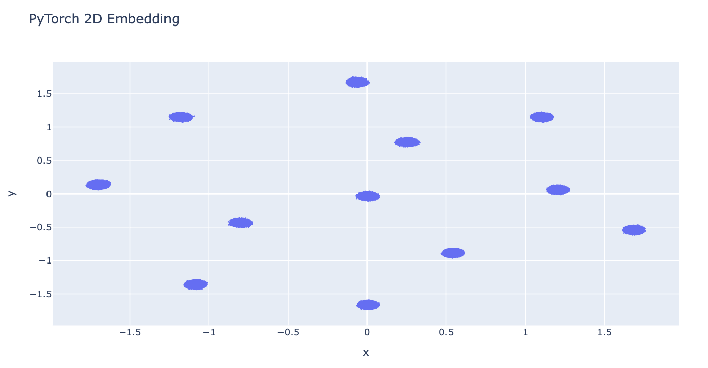

<!-- Logo + Project title -->
<p align="center">
  
</p>
<p align="center">
  <a href="https://opensource.org/licenses/Apache-2.0">
    
  </a>
  <a href="https://www.python.org/downloads/">
    
  </a>
  <a href="https://pypi.org/project/dire-rapids/">
    
  </a>
  <a href="https://pepy.tech/projects/dire-rapids">
    
  </a>
</p>
<p align="center">
  <a href="https://github.com/sashakolpakov/dire-rapids/actions/workflows/pylint.yml">
    
  </a>
  <a href="https://github.com/sashakolpakov/dire-rapids/actions/workflows/deploy_docs.yml">
    
  </a>
  <a href="https://sashakolpakov.github.io/dire-rapids/">
    
  </a>
</p>

# DiRe Rapids

GPU-accelerated implementation of [DiRe](https://github.com/sashakolpakov/dire-jax) using PyTorch and optionally NVIDIA RAPIDS for massive-scale datasets.

## What is DiRe?

DiRe (**Di**mensionality **Re**duction) is a dimensionality reduction algorithm based on force-directed graph layout. Unlike methods that focus solely on local neighborhood preservation, DiRe preserves both local and global structure of the data manifold, with theoretical guarantees for **homological stability** -- the topology (connected components, loops) of the original point cloud is faithfully reflected in the low-dimensional embedding. See the [paper on arXiv](https://arxiv.org/abs/2503.03156) for details.

## Performance

DiRe is **9--42x faster than UMAP** on CPU while delivering competitive or better embedding quality (neighborhood preservation). On GPU it leverages `torch.compile` for kernel fusion, pushing throughput even further.

| Dataset | N | D | DiRe (s) | UMAP (s) | Speedup |
|:---|---:|---:|---:|---:|---:|
| digits | 5,620 | 64 | 1.3 | 11.9 | **9.2x** |
| mnist_784 | 10,000 | 784 | 2.5 | 49.4 | **19.8x** |
| Fashion-MNIST | 10,000 | 784 | 2.3 | 46.6 | **20.3x** |
| har | 10,299 | 561 | 2.4 | 101.0 | **42.1x** |
| covertype | 20,000 | 54 | 3.9 | 43.9 | **11.3x** |

*Benchmarks on OpenML datasets; times are wall-clock on a single CPU core.*

At large scale (500K+ points), DiRe also **beats cuML UMAP on embedding quality** (neighborhood preservation), making it the best choice for both speed and fidelity on big data.

### Topological Preservation

DiRe is designed to preserve the topology of the original data manifold. We measure this by computing [Betti curves](https://en.wikipedia.org/wiki/Betti_number) on the original point cloud and on the 2D embedding, then comparing them via DTW distance (lower = better preservation):

| Dataset | Topology | DiRe DTW β₀ | cuML DTW β₀ | DiRe DTW β₁ | cuML DTW β₁ |
|:---|:---|---:|---:|---:|---:|
| circle (S¹) | β₀=1, β₁=1 | **56** | 76 | **29** | 47 |
| torus (T²) | β₀=1, β₁=2 | **38** | 48 | **36** | 41 |
| linked rings | β₀=2, β₁=2 | 66 | **65** | **17** | 42 |
| 5 blobs (R¹⁰) | β₀=5, β₁=0 | **33** | 37 | 378 | **370** |

DiRe wins 6 out of 8 comparisons, preserving both connected components (β₀) and loops (β₁) significantly better than cuML UMAP -- consistent with DiRe's theoretical guarantees for homological stability.

## Installation

### From PyPI (stable)

```bash
# Basic installation (CPU + PyTorch)
python -m pip install "dire-rapids==0.3.2"

# With PyKeOps support for the optional PyKeOps k-NN engine
python -m pip install "dire-rapids[keops]==0.3.2"

# With CUDA 12 CuPy support
python -m pip install "dire-rapids[cuda]==0.3.2"
```

### From Repository (development)

```bash
git clone https://github.com/sashakolpakov/dire-rapids.git
cd dire-rapids

python -m pip install -e .            # CPU + PyTorch
python -m pip install -e ".[cuda]"    # With CUDA 12 CuPy support
python -m pip install -e ".[keops]"   # With PyKeOps support
python -m pip install -e ".[dev]"     # Development (testing + dev tools)
```

#### With RAPIDS Support (Optional, GPU only)

Use a clean virtual environment. For the stable 0.3.2 CUDA 12 release, install
PyTorch from its dedicated wheel index first, followed by the `rapids` extra
from PyPI and the NVIDIA package index:

```bash
python -m pip install torch==2.11.0 \
  --index-url https://download.pytorch.org/whl/cu128
python -m pip install --extra-index-url https://pypi.nvidia.com \
  "dire-rapids[rapids,keops]==0.3.2"
```

For RAPIDS 26.06 and the all-neighbors implementation, choose exactly one
CUDA-specific development extra. Both extras pin cuML, cuVS, and cuDF to
RAPIDS 26.06.x. The development `rapids` extra remains an alias of
`rapids-cu12` for backward compatibility.

The core package supports Python 3.10+, while these RAPIDS extras require
Python 3.11--3.14.
The CUDA-specific extras are currently unreleased, so install this version
from a clone:

```bash
git clone https://github.com/sashakolpakov/dire-rapids.git
cd dire-rapids
```

CUDA 13 (recommended for the RAPIDS 26.06/Python 3.14 stack):

```bash
python -m pip install torch==2.11.0 \
  --index-url https://download.pytorch.org/whl/cu130
python -m pip install \
  --extra-index-url https://pypi.nvidia.com \
  -e ".[rapids-cu13,keops]"
```

CUDA 12:

```bash
python -m pip install torch==2.11.0 \
  --index-url https://download.pytorch.org/whl/cu128
python -m pip install \
  --extra-index-url https://pypi.nvidia.com \
  -e ".[rapids-cu12,keops]"
```

Do not install the CUDA 12 and CUDA 13 extras together. Install the pinned
PyTorch wheel first from its dedicated index; `cu128` above is for CUDA 12 and
`cu130` is for CUDA 13.

## Quick Start [](https://colab.research.google.com/github/sashakolpakov/dire-rapids/blob/main/benchmarking/dire_rapids_benchmarks.ipynb)

```python
from dire_rapids import DiRePyTorch, DiRePyTorchMemoryEfficient
from sklearn.datasets import make_blobs

# Generate sample data
X, _ = make_blobs(n_samples=1_000, centers=12, n_features=10, random_state=42)

# Standard PyTorch backend
reducer = DiRePyTorch(n_components=2, n_neighbors=16, verbose=True)
X_embedded = reducer.fit_transform(X)

# Memory-efficient backend (recommended for large datasets)
reducer = DiRePyTorchMemoryEfficient(n_components=2, n_neighbors=16, verbose=True)
X_embedded = reducer.fit_transform(X)
```



### Custom Distance Metrics

DiRe Rapids supports custom distance metrics for k-nearest neighbor computation while keeping layout forces Euclidean:

```python
# L1 (Manhattan) distance for k-NN
reducer = DiRePyTorch(metric='(x - y).abs().sum(-1)', n_neighbors=32, knn_backend='pytorch')
X_embedded = reducer.fit_transform(X)

# Cosine distance via callable
def cosine_distance(x, y):
    return 1 - (x * y).sum(-1) / (x.norm(dim=-1, keepdim=True) * y.norm(dim=-1, keepdim=True) + 1e-8)

reducer = DiRePyTorch(metric=cosine_distance, n_neighbors=32, knn_backend='pytorch')
X_embedded = reducer.fit_transform(X)
```

**Supported metric types:** `None` / `'euclidean'` / `'l2'` (default), string tensor expressions, or callable functions taking `(x, y)` tensors.

Custom metric expressions and callables run on the PyTorch/PyKeOps k-NN paths. cuVS supports named native metrics only; forcing `knn_backend='cuvs'` with a custom expression/callable raises.

### Available Backends

- **DiRePyTorch** -- Standard PyTorch implementation with adaptive chunking
- **DiRePyTorchMemoryEfficient** -- FP16 support, point-by-point force computation, optional PyKeOps lazy tensors for repulsion
- **DiReCuVS** -- RAPIDS cuVS backend for massive-scale datasets

`backend` selects the DiRe implementation. `knn_backend` selects the k-nearest-neighbor engine used inside that implementation. Leave `knn_backend='auto'` to use the built-in heuristics, or set it explicitly to `'pytorch'`, `'pykeops'`, or `'cuvs'`. Explicit k-NN backend requests are strict: unsupported engines raise instead of silently falling back.

### RAPIDS 26.06 All-Neighbors k-NN

`DiReCuVS` can build a full approximate k-NN graph (one row per input) through
the RAPIDS 26.06 cuVS all-neighbors API instead of constructing an ANN index
and querying the same dataset. This path supports partitioned, host-backed
operation and multiple GPUs, which avoids copying the entire input to one GPU
before graph construction. Use `all_neighbors_algo="brute_force"` when an
exact local graph is required.

```python
from dire_rapids import DiReCuVS

# Auto preserves the released index-and-search policy and its size thresholds.
reducer = DiReCuVS(cuvs_knn_method="auto")

# Explicit, experimental partitioned/out-of-core all-neighbors construction.
reducer = DiReCuVS(
    cuvs_knn_method="all_neighbors",
    all_neighbors_algo="nn_descent",
    all_neighbors_n_clusters=16,
    all_neighbors_device_ids=[0, 1],
)
```

Host-backed/out-of-core execution requires `all_neighbors_n_clusters > 1`.
Partitioning reduces the local graph-builder working set; the final `N × k`
index and distance graph still has to fit on one GPU.
`cuvs_knn_method` defaults to `"auto"`. The remaining defaults are
`all_neighbors_algo="nn_descent"`,
`all_neighbors_n_clusters=1`, `all_neighbors_device_ids=None`, and
`all_neighbors_algo_params=None`. `all_neighbors_overlap_factor=None` selects
0 for one cluster and `min(2, n_clusters - 1)` otherwise. `"auto"` and
`"index_search"` both retain the established index-and-search behavior.
All-neighbors remains explicit opt-in until it clears frozen neighbor-recall,
topology, local, context, and global embedding-quality gates; API availability
alone does not change the graph used by existing code.

An H100 A/B audit produced mixed results. At full scale, all-neighbors was
about 26% slower on 10x (0.623 graph overlap) but 1.91x faster on arXiv (0.839
overlap); downstream quality moved in both directions and balanced context
accuracy decreased by 1.62 and 0.84 percentage points, respectively. It was
therefore not promoted to the default, but remains a viable explicit option,
particularly given the arXiv performance. Full observations are recorded in
[PR #12](https://github.com/sashakolpakov/dire-rapids/pull/12); the harness and
raw-result workflow remain on the separate
[`homological-stability-repro@a00aa54`](https://github.com/sashakolpakov/homological-stability-repro/tree/a00aa54949a87ef64e7204ba7434a70155a51c1a)
test branch.

The legacy `cuvs_index_type="auto"` thresholds are:

| Rows / shape | Effective index |
|---|---|
| fewer than 50,000 | `flat` |
| 50,000 to fewer than 500,000, or more than 500 dimensions | `ivf_flat` |
| 500,000 to fewer than 5,000,000, at most 500 dimensions | `ivf_pq` |
| 5,000,000 or more, at most 500 dimensions, supported metric | `cagra` |
| otherwise | `ivf_pq` |

After fitting, requested policy, effective backend/index, pipeline timings, and
force-kernel fallback status are public and exportable:

```python
embedding = reducer.fit_transform(X)

print(reducer.effective_cuvs_knn_method_)
print(reducer.effective_cuvs_index_type_)
print(reducer.stage_timings_)
print(reducer.force_chunked_fallback_calls_)
record = reducer.get_diagnostics()  # JSON-serializable dictionary
```

Forcing an index or opting into all-neighbors can materially change both
runtime and approximation behavior. Benchmark records should therefore retain
the requested and effective policies alongside neighbor recall and downstream
embedding-quality results.

See the [cuVS all-neighbors API documentation](https://docs.rapids.ai/api/cuvs/stable/python_api/neighbors_all_neighbors/)
for the underlying RAPIDS interface.

### Backend and k-NN Engine Selection

```python
from dire_rapids import create_dire

# Auto-select reducer implementation and k-NN engine
# Implementation priority: cuVS > PyTorchMemoryEfficient > PyTorch > CPU
reducer = create_dire(n_neighbors=32, verbose=True)
X_embedded = reducer.fit_transform(X)

# Force memory-efficient backend with FP16
reducer = create_dire(memory_efficient=True, use_fp16=True)
X_embedded = reducer.fit_transform(X)

# Force the k-NN engine independently of the reducer implementation
reducer = create_dire(backend='pytorch_cpu', knn_backend='pytorch')

# Force PyKeOps or cuVS for k-NN when those optional dependencies are available
reducer = create_dire(knn_backend='pykeops')
reducer = create_dire(knn_backend='cuvs')
```

## Betti Curves / Topology

The `betti_curve` module computes **filtered Betti curves** that track topological features across filtration thresholds. By default it builds a kNN atlas complex and updates Betti numbers incrementally with union-find for beta\_0 and GF(2) bitset elimination for beta\_1. Ripser remains available as an explicit reference backend.

```python
from dire_rapids.betti_curve import compute_betti_curve

# Default backend selection: GPU atlas, then CPU atlas
result = compute_betti_curve(X, k_neighbors=20, n_steps=50)

# Explicit reference-backend selection: ripser, then atlas if unavailable
reference = compute_betti_curve(X, n_steps=50, prefer_ripser=True)

print(result['filtration_values'])  # filtration thresholds
print(result['beta_0'])             # connected components at each step
print(result['beta_1'])             # 1-cycles (loops) at each step
```

The Atlas path uses GPU kNN when cuVS/cuML is available, then performs the set-heavy atlas merge and incremental rank update on CPU. No topology-tuned public preset is exported: its fixed-sample Ripser selection did not survive the paired held-out Atlas audit described in the changelog.

## ReducerRunner Framework

General-purpose framework for running and comparing dimensionality reduction algorithms. See [benchmarking/dire_rapids_benchmarks.ipynb](benchmarking/dire_rapids_benchmarks.ipynb) for complete examples.

```python
from dire_rapids.utils import ReducerRunner, ReducerConfig
from dire_rapids import create_dire

config = ReducerConfig(
    name="DiRe",
    reducer_class=create_dire,
    reducer_kwargs={"n_neighbors": 16},
    visualize=True,
    max_points=10000,      # subsample cap for scatter rendering
    mode="auto",           # 'auto' | 'scatter' | 'density'
    density_threshold=50000  # 'auto' switches 2D to density above this many points
)

runner = ReducerRunner(config=config)
result = runner.run("sklearn:digits")
result = runner.run("openml:mnist_784")
```

**Data sources:** `sklearn:name`, `openml:name`, `cytof:name`, `dire:name` (geometric datasets), `file:path` (.csv, .npy, .npz, .parquet).

### Large-embedding density rendering

Plotting hundreds of thousands of individual markers is slow (every point is shipped to the browser) and illegible (overplotting collapses structure into a blob). For large 2D embeddings, `DiRePyTorch.visualize` and `ReducerRunner` therefore switch from per-point scatter to a **binned density**: points are reduced to a fixed `n_bins × n_bins` grid with `np.histogram2d` (O(n_points), server-side), so the figure payload stays bounded no matter how many points there are.

- `mode='auto'` (default) uses density once a 2D embedding exceeds `density_threshold` points; `'scatter'` always draws markers; `'density'` forces it (2D only — 3D falls back to scatter).
- Categorical labels render as a **per-category density overlay** (one filled-contour layer per class); unlabeled data renders a count heatmap, and continuous labels a mean-value heatmap.

```python
from dire_rapids import build_embedding_figure  # also used internally

fig = build_embedding_figure(embedding, labels, mode="density", categorical_labels=True)
fig.show()
```

## Metrics Module

Evaluation metrics for dimensionality reduction quality:

```python
from dire_rapids.metrics import evaluate_embedding

results = evaluate_embedding(data, layout, labels, compute_topology=True)
print(f"Stress: {results['local']['stress']:.4f}")
print(f"SVM accuracy: {results['context']['svm'][1]:.4f}")
print(f"DTW beta_0: {results['topology']['metrics']['dtw_beta0']:.6f}")
print(f"DTW beta_1: {results['topology']['metrics']['dtw_beta1']:.6f}")
print(results['topology']['protocol'])
```

Topology protocol parameters are exposed as `topology_n_steps`, `topology_k_neighbors`,
`topology_density_threshold`, `topology_overlap_factor`, and `topology_metrics_only`.

**Metrics:** distortion (stress, neighborhood preservation), context (SVM/kNN accuracy), topology (DTW distances between Betti curves). See [METRICS_README.md](METRICS_README.md) for details.

## Testing

```bash
# CPU tests (CI)
pytest tests/test_cpu_basic.py tests/test_reducer_runner.py -v

# Full test suite
pytest tests/ -v
```

## Citation

If you use this work, please cite:

```bibtex
@misc{kolpakov-rivin-2025dimensionality,
  title={Dimensionality reduction for homological stability and global structure preservation},
  author={Kolpakov, Alexander and Rivin, Igor},
  year={2025},
  eprint={2503.03156},
  archivePrefix={arXiv},
  primaryClass={cs.LG},
  url={https://arxiv.org/abs/2503.03156}
}
```

## Requirements

- Python 3.10+
- PyTorch 2.0+
- NumPy, SciPy, scikit-learn
- (Optional) PyKeOps 2.1+ (`python -m pip install "dire-rapids[keops]==0.3.2"`)
- (Optional) a matching CUDA 12 or CUDA 13 stack for GPU acceleration
- (Optional, Python 3.11--3.14) RAPIDS 26.06.x for the cuVS k-NN and all-neighbors engines
- (Optional) CuPy for GPU-accelerated Betti curves

<p align="center">
  <a href="https://submitaitools.org/github-com-sashakolpakov-dire-rapids/">
    
  </a>
</p>
